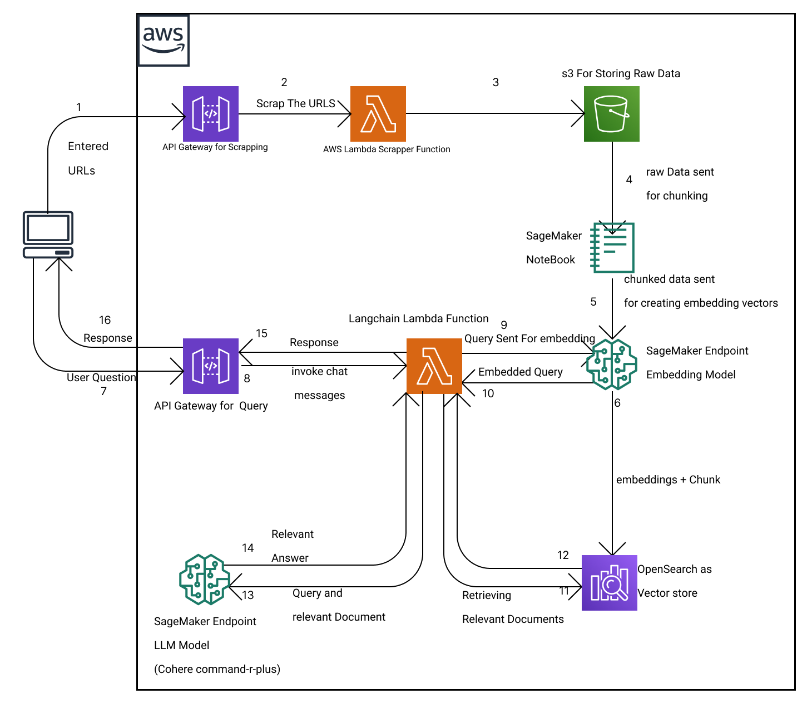
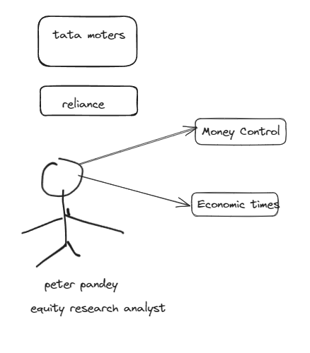
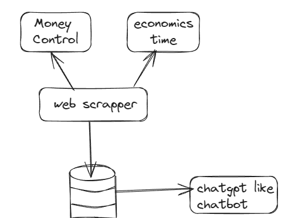
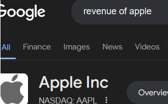
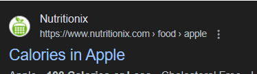
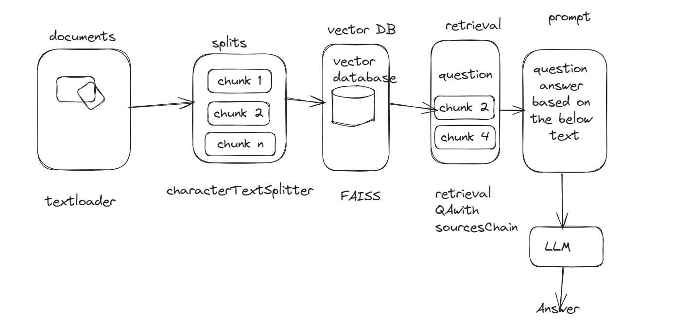
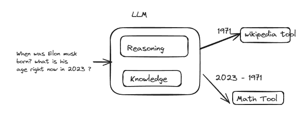

# 📈 FinGuru: News Research Tool

FinGuru is a news research tool that processes and analyzes news articles from given URLs and PDF. It leverages LangChain, Google embeddings, and Streamlit to provide insights and answers based on the content of the articles.

## 🎯 Features

- Fetch and parse news articles from URLs Or parse data from given pdf
- Split articles into manageable chunks
- Create embeddings for the text using GoogleEmbedding Model
- Store embeddings in a FAISS index for efficient retrieval
- Query the processed data to get answers and sources

## 🏗️ How It's Built

- Python 3.7+
- Streamlit
- LangChain
- Google API Key
- GOOGLE_CSE_ID

## Used LLM

`google gemini-pro`

## AWS Architecture



# Equity Research Analysis




### Tech Architecture

    - Issue 1 : Copy pasting article in ChatGPt is tedious
    - Issue 2 : We need an aggregate knowledge base




### Revenue of apple



### calories in apple



`Semantic search`

## Vector Database



## Agents



### Used Agents

`Wikipedia`
`Google Search`
`Google Finance`
`duckduckGo search `

# 🚀 Getting Started

## Installation

### 1. Clone the repository:

```bash
git clone https://github.com/mihirh19/news_research_tool_Equity-Research-Analysis-.git
cd news_research_tool_Equity-Research-Analysis-
```

### 2. Create and activate a virtual environment:

```bash
python -m venv venv
source venv/bin/activate  # On Windows use `venv\Scripts\activate`
```

### 3. Install the required packages:

```bash
   pip install -r requirements.txt
```

## Setup

1. First, you need to set up the proper API keys and environment variables. To set it up, create the GOOGLE_API_KEY in the Google Cloud credential console (https://console.cloud.google.com/apis/credentials) and a GOOGLE_CSE_ID using the Programmable Search Engine (https://programmablesearchengine.google.com/controlpanel/create). Next, it is good to follow the instructions found here.

2. create api key on https://serpapi.com/

### 3. Create a file named `secrets.toml` in the `.streamlit` directory with the following content:

```toml
GOOGLE_API_KEY = "your-google-api-key"
GOOGLE_CSE_ID = "your-cse-id"
SERP_API_KEY ="your-"
```

## Running the Application

```bash
streamlit run app.py
```

## Usage

1.  Open the Streamlit application in your browser.
2.  Select options From dropdown Menu in the sidebar
3.  For URL :
    - Enter the number of URLs you want to process in the sidebar.
    - Provide the URLs for the news articles.
    - Click on "Process URLs" to fetch and analyze the articles.
4.  For pdf
    - Upload a PDF.
    - Click on "process Pdf" to analyze the PDF.
5.  Enter a query in the text input box and click "Submit" to get answers based on the processed data.

### You can also use the advance google search for financial questions.

## Example 1 URL :

1.  enter 3 as number of urls
2.  provide following urls:
    1. https://www.moneycontrol.com/news/business/tata-motors-to-use-new-1-billion-plant-to-make-jaguar-land-rover-cars-report-12666941.html
    2. https://www.moneycontrol.com/news/business/stocks/tata-motors-stock-jumps-x-after-robust-jlr-sales-brokerages-bullish-12603201.html
    3. https://www.moneycontrol.com/news/business/stocks/buy-tata-motors-target-of-rs-1188-sharekhan-12411611.html
3.  Click "Process URLs" to start processing.
4.  Enter a query like `what is the target price of tata motors ?` and click `Submit` to get the answer.

## Example 2 PDF :

1. [AnnualReport202223.pdf](https://github.com/mihirh19/news_research_tool_Equity-Research-Analysis-/files/15366094/AnnualReport202223.pdf) Upload the Given PDF

2. Click "Process PDF" to start processing.
3. Enter a query like `what is the yoy change of revenue of tata motors ? `and click `Submit` to get answer.

## Author

👤 **Mihir Hadavani**

- Twitter: [@mihirh21](https://twitter.com/mihirh21)
- Github: [@mihirh19](https://github.com/mihirh19)
- LinkedIn: [@mihir-hadavani-996263232](https://linkedin.com/in/mihir-hadavani-996263232)

## Show your support
<a href="https://www.buymeacoffee.com/mihir21"></a>

Give a ⭐️ if this project helped you!
